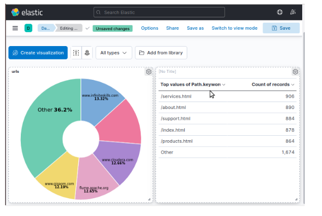

# Log Streaming and Visualization with PySpark, Elasticsearch, and Kibana

This project demonstrates how to use PySpark, Elasticsearch, and Kibana to stream and visualize log data in real-time.

## Table of Contents
- [Overview](#overview)
- [Prerequisites](#prerequisites)
- [Installation](#installation)
- [Usage](#usage)
- [Use Case: Analyzing Customer Behavior](#usecase)


## Overview
The project consists of two main parts:
1. **Log Generation Script**: A Python script that continuously generates random log entries and writes them to a log file.
2. **PySpark Streaming Script**: A PySpark script that reads log data from the log file, processes it, and writes the processed data to Elasticsearch for visualization in Kibana.

The log generation script generates log entries with random HTTP statuses, URLs, paths, and IP addresses. The PySpark streaming script sets up a streaming context, reads log lines from the log file directory, processes the log data, and writes it to Elasticsearch. The logs can then be visualized using Kibana.

## Prerequisites
Before running this project, make sure you have the following prerequisites installed:
- Apache Spark (with PySpark)
- Elasticsearch
- Kibana

## Installation
1. Clone this repository to your local machine.
2. Install the required Python dependencies by running the following command:
   ```
   pip install -r requirements.txt
   ```
3. Set up Apache Spark, Elasticsearch, and Kibana according to your environment. Make sure they are properly configured and running.

## Usage
1. Open a terminal and navigate to the project directory.
2. Run the log generation script to continuously generate logs:
   ```
   python3 log_generation_script.py &
   ```
3. In a separate terminal, run the PySpark streaming script for Spark Streaming:
   ```
   spark-submit --packages org.elasticsearch:elasticsearch-spark-30_2.12:7.15.1 spark_streaming_script.py
   ```
4. The log generation script will start generating logs, and the PySpark script will read and process the logs in real-time.
5. Open Kibana and configure an index pattern to visualize the log data stored in Elasticsearch.
6. Explore and visualize the log data in Kibana using various visualizations and dashboards.


## Use Case: Analyzing Customer Behavior
One potential use case for this project is analyzing customer behavior to identify the most visited websites. By analyzing the log data, you can gain insights into customer preferences and make informed decisions. Here's how this use case can be applied:

The log generation script continuously generates random log entries representing customer activities, including details such as HTTP status, URLs, paths, and IP addresses.


The PySpark streaming script reads the log entries in real-time, processes them using Spark Streaming, and extracts relevant information, including the visited websites.

The processed log data, including the visited websites, is stored in Elasticsearch.


Kibana connects to Elasticsearch and provides a visual interface for exploring and analyzing the data. You can create custom visualizations and dashboards to gain insights into customer behavior.

To identify the most visited websites, you can use Kibana's visualization capabilities. For example, you can create a bar chart or a data table that shows the count of visits for each website. This visualization can be sorted in descending order to identify the top visited websites.


By regularly monitoring and analyzing the most visited websites, your company can make informed decisions about website improvements, content prioritization, marketing campaigns,

